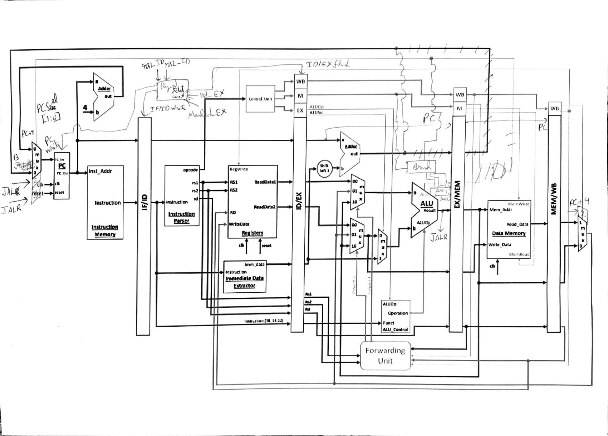
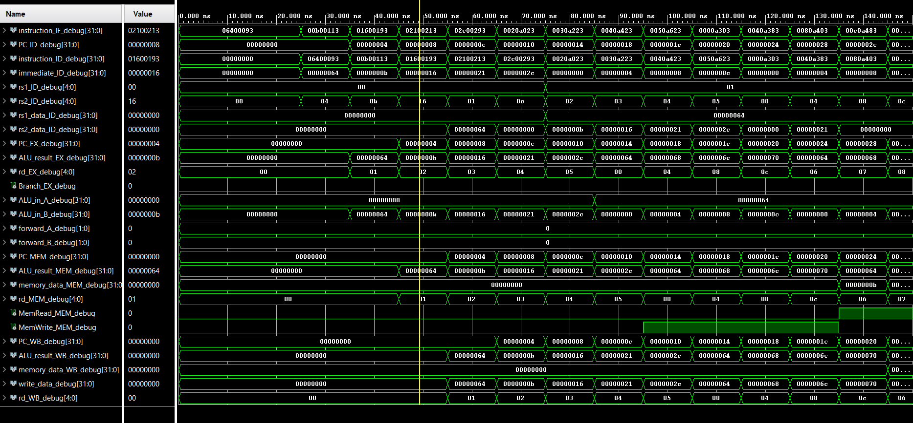
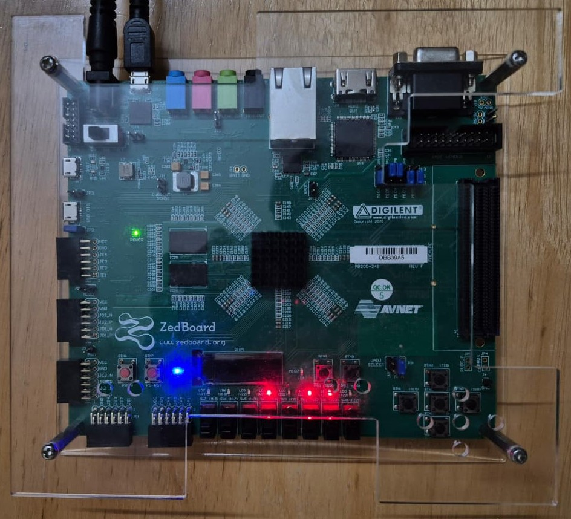
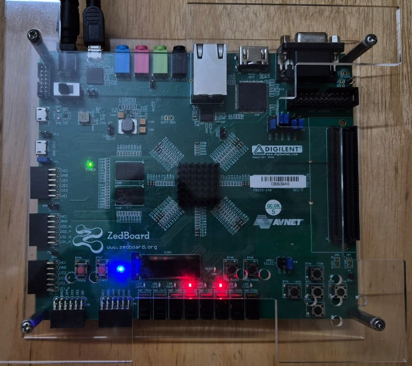

# 5-Stage Pipelined RISC-V Processor (RV32I)

A fully functional **5-stage pipelined** RISC-V processor implemented in Verilog, supporting all **37 base integer (RV32I)** instructions. Built for learning, waveform-level debugging, and FPGA prototyping.

---

## Block Diagram



---

## Supported Instructions

| Type | Instructions |
|------|-------------|
| **R-type** | ADD, SUB, AND, OR, XOR, SLL, SRL, SRA, SLT, SLTU |
| **I-type (ALU)** | ADDI, ANDI, ORI, XORI, SLTI, SLTIU, SLLI, SRLI, SRAI |
| **I-type (Load)** | LB, LH, LW, LBU, LHU |
| **S-type (Store)** | SB, SH, SW |
| **B-type (Branch)** | BEQ, BNE, BLT, BGE, BLTU, BGEU |
| **U-type** | LUI, AUIPC |
| **J-type** | JAL, JALR |

---

## Project Structure

```
├── rtl/
│   ├── core/
│   │   ├── processor.v              # Top-level pipeline (IF/ID/EX/MEM/WB)
│   │   ├── PC.v                     # Program counter register (with stall enable)
│   │   ├── PC_adder.v               # PC + 4
│   │   ├── IF_ID_pipe_reg.v         # IF/ID pipeline register (stall + flush)
│   │   ├── ID_EX_pipe_reg.v         # ID/EX pipeline register (flush)
│   │   ├── EX_MEM_pipe_reg.v        # EX/MEM pipeline register
│   │   ├── MEM_WB_pipe_reg.v        # MEM/WB pipeline register
│   │   ├── register_file.v          # 32 x 32-bit register file (debug readback)
│   │   ├── imm_gen.v                # Immediate generator (all RV32I formats)
│   │   ├── hazard_detection_unit.v  # Load-use hazard stall/flush logic
│   │   └── forwarding_unit.v        # EX-stage forwarding mux select
│   ├── control/
│   │   └── main_control_unit.v      # Opcode decoder → control signals
│   ├── execution/
│   │   ├── ALU.v                    # ALU with compare flags (Zero/Less/LessU)
│   │   └── ALU_control_unit.v       # ALUOp + funct3/funct7 → ALU select
│   ├── memory/
│   │   ├── instruction_mem.v        # Instruction ROM (loads program.mem)
│   │   ├── data_memory.v            # Data RAM (LB/LH/LW + unsigned variants)
│   │   └── data.mem                 # Initial data memory contents
│   └── utils/
│       ├── adder.v                  # Generic 32-bit adder
│       ├── mux.v                    # 2-to-1 multiplexer
│       └── mux4to1.v                # 4-to-1 multiplexer
├── sim/
│   └── processor_tb.v               # Testbench (stage-by-stage debug outputs)
├── demo_programs/
│   ├── bubble_sort/program.mem
│   └── sum_of_n_natural_nums/program.mem
├── fpga/
│   ├── top.v                        # FPGA top: register debug → LEDs
│   └── constraints/constraints.xdc
└── images/
```

---

## How It Works (Pipeline)

The CPU is split into the classic 5 stages:

1. **IF (Fetch)** — Fetches instruction at `PC` and computes `PC+4`.
2. **ID (Decode/Register Read)** — Decodes opcode into control signals, generates immediates, reads `rs1`/`rs2`.
3. **EX (Execute/Address/Branch)** — Runs the ALU, calculates branch/jump targets, and resolves branch/jump decisions.
4. **MEM (Data Memory)** — Performs load/store with byte/halfword/word access.
5. **WB (Write Back)** — Selects write-back data (ALU result / load data / `PC+4`) and writes to `rd`.

After the pipeline fills, the design targets a throughput of **one instruction per cycle**, except when hazards force stalls/flushes.

---

## Hazard Handling

**Data hazards**

- A **forwarding unit** selects EX-stage operands from:
  - the ID/EX register values,
  - the EX/MEM ALU result,
  - the MEM/WB write-back value.

**Load-use hazard (stall)**

- If an instruction in **EX** is a load and the instruction in **ID** needs that loaded register, the hazard unit:
  - stalls `PC` and `IF/ID` for 1 cycle, and
  - flushes `ID/EX` to insert a bubble.

**Control hazards (flush)**

- Branches and jumps are resolved in **EX**.
- When a branch is taken or a JAL/JALR occurs, the pipeline front-end is flushed to discard wrong-path instructions.

---

## Demo Programs

This repo includes a couple of ready-to-run instruction memory images:

- Bubble sort: `demo_programs/bubble_sort/program.mem`
- Sum of N naturals: `demo_programs/sum_of_n_natural_nums/program.mem`

### About `program.mem` and `data.mem`

The RTL loads memory contents using `$readmemh("program.mem", ...)` and `$readmemh("data.mem", ...)`.

Most simulators (and Vivado) will look for these files in the **simulation run directory**. A simple workflow is:

1. Copy the desired demo program to the run directory as `program.mem`.
2. Copy `rtl/memory/data.mem` to the run directory as `data.mem`.

(Alternatively, add them as simulation sources and configure your simulator’s working directory accordingly.)

---

## Running in Simulation

1. Open `sim/processor_tb.v` in your simulator (Vivado Simulator, ModelSim, etc.).
2. Ensure `program.mem` and `data.mem` are available (see note above).
3. Run the simulation and inspect waveforms. The top-level pipeline exposes debug signals for each stage (PC, instruction, ALU result, memory data, write-back, forwarding selects, etc.).

### Simulation Waveform



---

## FPGA Deployment

The FPGA wrapper is in `fpga/top.v` and the pin map is in `fpga/constraints/constraints.xdc`.

- **Switches `sw[4:0]`**: select which register index is read out from the register file debug port.
- **LEDs `led[7:0]`**: display the low 8 bits of the selected register.
- **Reset button (`btn_reset`)**: resets the processor.

### Example Results

#### Load/Store Test — LEDs show 16

This demo validates basic loads/stores; the LEDs display the value **16** (low 8 bits).



#### Sum of 1..1000 — 500500 (0x0007A314)

The sum of the first 1000 natural numbers is **500500** (= `0x0007A314`). The LEDs show the **lower 8 bits** of that result.


